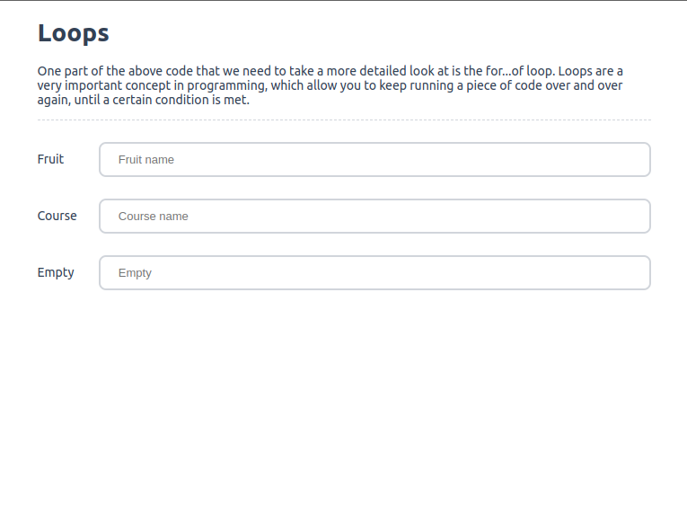
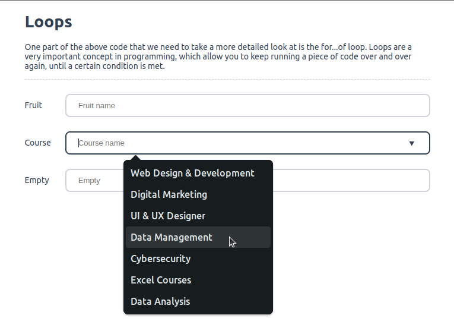

# JS - One function, multiple options.

<p align="center">
  
  
</p>

**HTML**
```html
<div class="input-group mb-3">
    <label for="fruit_name">Fruit</label>
    <input type="search" name="fruit_name" id="fruit_name" class="form-control" list="optionFruits" placeholder="Fruit name" aria-label="fruitname" required />
    <datalist id="optionFruits"></datalist>
</div>

<div class="input-group mb-3">
    <label for="courses_name">Courses</label>
    <input type="search" name="courses_name" id="courses_name" class="form-control" list="optionCoursesName" placeholder="Courses name" aria-label="coursesname" required />
    <datalist id="optionCoursesName"></datalist>
</div>

<div class="input-group mb-3">
    <label for="empty">Empty</label>
    <input type="search" name="empty" id="empty" class="form-control" list="optionEmpty" placeholder="Empty" aria-label="empty" />
    <datalist id="optionEmpty"></datalist>
</div>
```

**CSS**
```css
body {
    font-family: ui-sans-serif, system-ui, sans-serif, "Apple Color Emoji", "Segoe UI Emoji", "Segoe UI Symbol", "Noto Color Emoji";
    font-weight: normal;
    font-size: 14px;
    color: #334155;
    width: calc(100% - 50%);
    margin-right: auto;
    margin-left: auto;
}

input {
    border: 2px solid #d1d5db;
    padding: 0.625rem 1.25rem 0.625rem 1.25rem;
    border-radius: 0.5rem;
    font-size: .8125rem;
    color: #334155;
    outline: none;
    width: calc(100% - 10%);
}

input:focus { border-color: #334155; }

.input-group {
    display: flex;
    justify-content: space-between;
    align-items: center;
}

.mb-3 { margin-bottom: 1.5rem; }
.hr { border-bottom: 1px dashed #d1d5db; }
```

**JavaScript**
```js
/**
 * List options
 *
 * @param {string} id
 * @param {any} values
 * @return {array|string} element
 */
function listOptions( id, values ) {
  const options = document.getElementById( id );
  const element = [];

  for ( const value of values ) {
    // console.log(value);
    ( ! value ) ? element.push(`<option value="Empty">`) : element.push(`<option value="${value}">`);
  }

  options.innerHTML = element.join("", ",");
}

// fruits
const fruits = ["Apple", "banana", "cherries", "Blueberry", "Grapes", "Blackberry", "Cherry", "Coconut", "Pomegranate", "Cucumber", "Dragonfruit", "Guava", "Jackfruit", "Plum", "Lime", "Mango", "Watermelon", "Mulberry", "Orange", "Papaya", "Strawberry", "Pineapple"];
listOptions( "optionFruits", fruits );

// courses
const courses = ["Web Design & Development", "Digital Marketing", "UI & UX Designer", "Data Management", "Cybersecurity", "Excel Courses", "Data Analysis"];
listOptions( "optionCoursesName", courses );

// empty
const empty = [''];
listOptions( "optionEmpty", empty );
```
