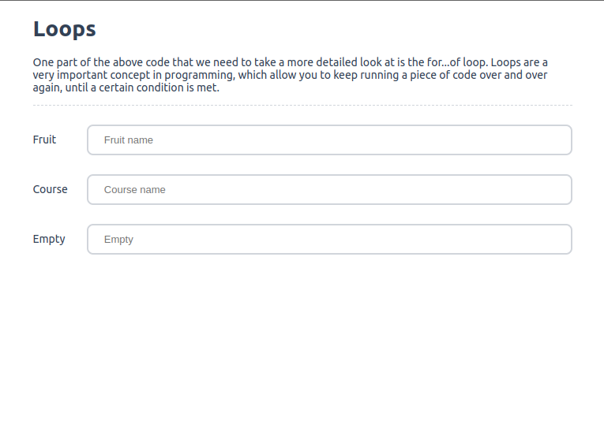
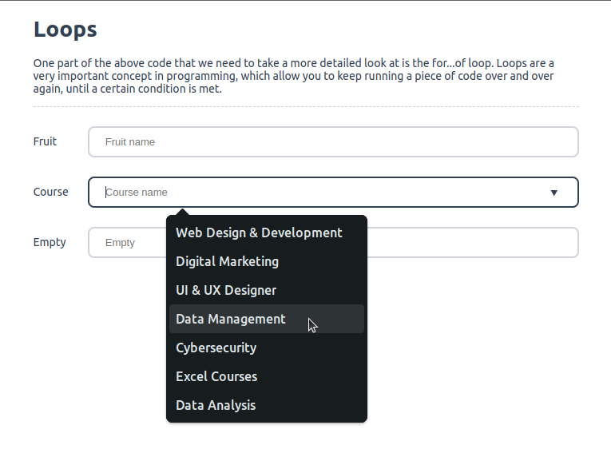

# JS Loop Options

<p align="center">
  
  
</p>

**HTML**
```html
<div class="mb-3 hr">
    <h1>Loops</h1>
    <p>One part of the above code that we need to take a more detailed look at is the for...of loop. Loops are a very important concept in programming, which allow you to keep running a piece of code over and over again, until a certain condition is met.</p>
</div>

<div class="input-group mb-3">
    <label for="fruit_name">Fruit</label>
    <input type="search" name="fruit_name" id="fruit_name" class="form-control" list="optionsFruits" placeholder="Fruit name" aria-label="fruitname" required />
    <datalist id="optionsFruits"></datalist>
</div>

<div class="input-group mb-3">
    <label for="course_name">Course</label>
    <input type="search" name="course_name" id="course_name" class="form-control" list="optionsCourseName" placeholder="Course name" aria-label="coursename" required />
    <datalist id="optionsCourseName"></datalist>
</div>

<div class="input-group mb-3">
    <label for="empty">Empty</label>
    <input type="search" name="empty" id="empty" class="form-control" list="optionsEmpty" placeholder="Empty" aria-label="empty" />
    <datalist id="optionsEmpty"></datalist>
</div>
```

**CSS**
```css
body {
    font-family: ui-sans-serif, system-ui, sans-serif, "Apple Color Emoji", "Segoe UI Emoji", "Segoe UI Symbol", "Noto Color Emoji";
    font-weight: normal;
    font-size: 14px;
    color: #334155;
    width: calc(100% - 50%);
    margin-right: auto;
    margin-left: auto;
}

input {
    border: 2px solid #d1d5db;
    padding: 0.625rem 1.25rem 0.625rem 1.25rem;
    border-radius: 0.5rem;
    font-size: .8125rem;
    color: #334155;
    outline: none;
    width: calc(100% - 10%);
}

input:focus { border-color: #334155; }

.input-group {
    display: flex;
    justify-content: space-between;
    align-items: center;
}

.mb-3 { margin-bottom: 1.5rem; }
.hr { border-bottom: 1px dashed #d1d5db; }
```

**JavaScript**
```js
/**
 * Options Values
 *
 * @param {int} id
 * @param {any} values
 * @return {array} element
 */
function optionsValue( id, values ) {
  const options = document.getElementById( id );
  const element = [];

  for ( const value of values ) {
    // console.log(fruit);
    // if ( ! value ) { element.push(`<option value="Empty">`); } element.push(`<option value="${value}">`);

    ( ! value ) ? element.push(`<option value="Empty">`) : element.push(`<option value="${value}">`);
  }

  options.innerHTML = element.join("", ",");
}

// fruits
const fruits = ["Apple", "banana", "cherries", "Blueberry", "Grapes", "Blackberry", "Cherry", "Coconut", "Pomegranate", "Cucumber", "Dragonfruit", "Guava", "Jackfruit", "Plum", "Lime", "Mango", "Watermelon", "Mulberry", "Orange", "Papaya", "Strawberry", "Pineapple"];
optionsValue( "optionsFruits", fruits );

// course
const course = ["Web Design & Development", "Digital Marketing", "UI & UX Designer", "Data Management", "Cybersecurity", "Excel Courses", "Data Analysis"];
optionsValue( "optionsCourseName", course );

// empty
const empty = [''];
optionsValue( "optionsEmpty", empty );
```
